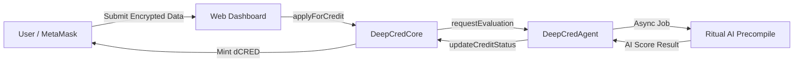

# 🧠 DeepCred AI


**DeepCred AI** is a decentralized, AI-driven credit scoring platform built for the modern Web3 economy. By leveraging the power of **Ritual's AI Coprocessors** and **Fully Homomorphic Encryption (FHE)**, DeepCred provides privacy-preserving, bias-free, and instantaneous credit lines for businesses and individuals on-chain.

🚀 **Live Demo:** [https://deepcred-ai.vercel.app](https://deepcred-ai.vercel.app)
🌐 **Network:** Ritual Testnet (Chain ID: 1979)
📄 **Smart Contract:** `0x0b97cfe0F65C5e1288CbD7901df20c98bEffE72a`

---

## 🌟 Key Features

- 🤖 **On-Chain AI Inference:** Evaluates encrypted identity and financial data using Ritual's AI models directly on-chain without exposing sensitive user information.
- 🔒 **Privacy-Preserving (FHE):** Users upload their encrypted data (Tax IDs, Financial history). The AI evaluates the data while it remains encrypted.
- ⚡ **Instant Credit Issuance:** Automatically mints and allocates `dCRED` (DeepCred Stablecoin) directly to the user's wallet upon approval.
- 📱 **Seamless dApp Experience:** A clean, professional, and minimalist dashboard that connects seamlessly with MetaMask to handle Web3 transactions.

## 🏗 Architecture

The system consists of three main components:

1.  **Frontend Dashboard:** A lightweight vanilla JS + TailwindCSS frontend using `viem` to interact with the blockchain.
2.  **DeepCredCore Contract:** The main orchestrator that holds user profiles, manages the `dCRED` ERC20 token, and handles the application state.
3.  **DeepCredAgent Contract:** The AI bridge that formats user data and requests asynchronous AI inference jobs from Ritual's TEE precompiles.



## 🛠 Technologies Used

-   **Smart Contracts:** Solidity, Foundry (Forge/Cast)
-   **Frontend:** HTML5, TailwindCSS, ES Modules
-   **Web3 Integration:** `viem` v2.7.9
-   **Blockchain:** Ritual Testnet
-   **Deployment:** Vercel

## 🚀 Getting Started (Local Development)

### Prerequisites
- [Foundry](https://getfoundry.sh/) (Forge, Cast)
- [Node.js](https://nodejs.org/) (for serving frontend locally)
- MetaMask Wallet configured with Ritual Testnet.

### 1. Smart Contract Deployment
```bash
# Clone the repository
git clone https://github.com/your-username/deepcred-ai.git
cd deepcred-ai

# Install dependencies
forge install foundry-rs/forge-std --no-commit

# Deploy to Ritual Testnet
forge script script/Deploy.s.sol:DeployScript --rpc-url https://rpc.ritualfoundation.org --broadcast --private-key YOUR_PRIVATE_KEY
```

### 2. Frontend Setup
1. Open `frontend/app.html`.
2. Update the `CORE_ADDRESS` constant with your newly deployed contract address.
3. Serve the `frontend` folder using any local web server (e.g., `npx serve frontend`).

## 🏆 Hackathon Track

This project was built to showcase the power of integrating **AI Coprocessors** into standard DeFi workflows, proving that complex, data-heavy computations (like credit scoring) can be done natively on-chain without sacrificing user privacy.

---
*Built with ❤️ for the Web3 & AI Hackathon.*
